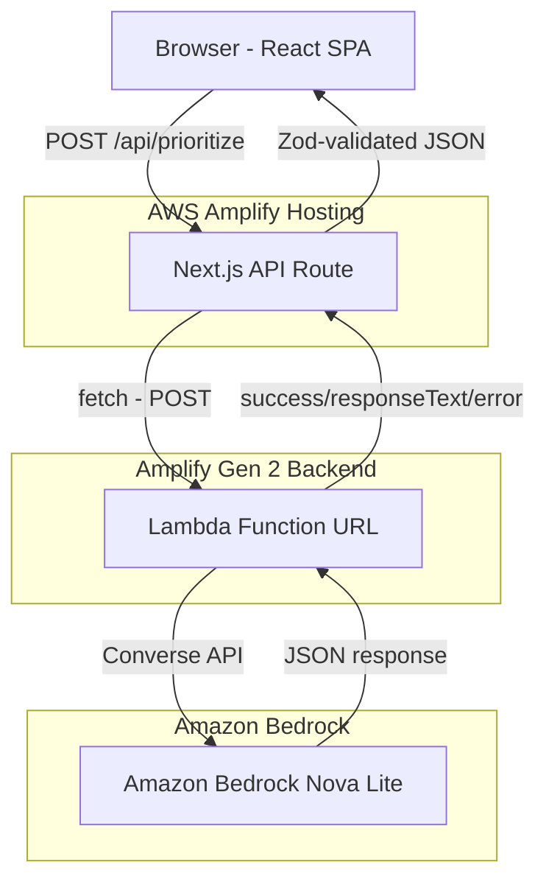
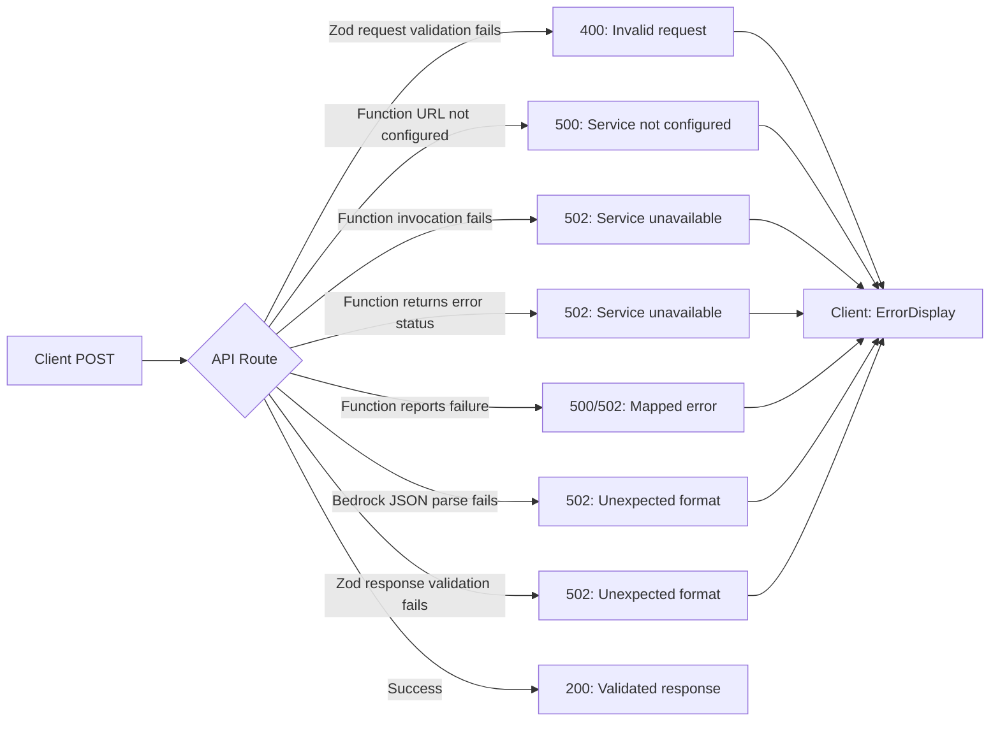

# Design Document: DeadlineForge AI

## Overview

DeadlineForge AI is a single-page Next.js application that accepts a list of tasks (with optional deadlines and durations), sends them to Amazon Bedrock Nova Lite via the Converse API, and displays an AI-prioritized plan with allocated time per task. The app is stateless, requires no authentication, and deploys on AWS Amplify Hosting.

The architecture uses a Lambda function URL pattern: the Next.js API route validates requests and delegates to an Amplify Gen 2 Lambda function that has the IAM permissions to call Bedrock. This avoids credential issues in the Amplify SSR compute environment.

The architecture is intentionally minimal for a weekend MVP: one page, one API route, one Lambda function, shared Zod schemas, and a single external dependency (Bedrock). No database, no auth, no client-side routing.

## Architecture



**Data flow:**
1. User enters tasks + available time in the React UI
2. Client parses text into task lines, validates locally, sends POST to `/api/prioritize`
3. API route validates request with Zod, then invokes the Prioritize Lambda function via its function URL using `fetch()`
4. Lambda function constructs the prompt, calls Bedrock Converse API with the validated tasks
5. Lambda returns `{success, responseText?, error?}` to the API route
6. API route parses the Bedrock JSON response and validates with Zod response schema
7. Validated response sent back to client for rendering

**Runtime:** Standard Node.js (not Edge) for the API route — required for Amplify compute. The Lambda function runs in its own execution environment with IAM credentials.

**Why Lambda function URL?** The Amplify SSR compute environment does not provide AWS credentials to the Next.js runtime. By using a Lambda function with an IAM role (granted `bedrock:InvokeModel`), we avoid credential issues entirely. The function URL (auth: NONE, CORS enabled) allows the API route to invoke it via a simple HTTP POST.

## Components and Interfaces

### React Component Tree

```
app/page.tsx (Page)
├── components/Header.tsx
├── components/ExampleTasksButton.tsx
├── components/ResetButton.tsx
├── components/TaskForm.tsx
│   ├── <textarea> for task input
│   ├── <input type="number"> for available time
│   └── <button> submit ("Prioritize My Tasks")
├── components/LoadingIndicator.tsx
├── components/ErrorDisplay.tsx
│   └── <button> retry
├── components/EmptyState.tsx
└── components/ResultsDisplay.tsx
    ├── components/Summary.tsx
    ├── components/WarningsList.tsx
    └── components/TaskCard.tsx (repeated per task)
```

### Component Responsibilities

| Component | Responsibility |
|-----------|---------------|
| `Page` | Top-level layout, owns all state (task text, available time, loading, result, error) |
| `Header` | Renders app name "DeadlineForge AI" |
| `ExampleTasksButton` | "Use Example Tasks" button that fills the textarea with demo data. Calls parent's `onLoadExample` handler |
| `ResetButton` | "Reset" button that clears all state back to initial values. Calls parent's `onReset` handler |
| `TaskForm` | Text input, time input, submit button. Calls parent's `onSubmit` handler |
| `LoadingIndicator` | Shown while API call in flight |
| `ErrorDisplay` | Shows user-friendly error message + retry button |
| `EmptyState` | Friendly placeholder shown before any prioritization, explains how to use the app |
| `ResultsDisplay` | Container for summary, warnings, and task cards |
| `Summary` | Renders the `summary` string from the response |
| `WarningsList` | Renders warnings array above task cards |
| `TaskCard` | Single prioritized task: rank, urgency badge, reason, duration, allocation, assumptions |

### State Management

All state lives in `Page` component via `useState`:

```typescript
const [taskText, setTaskText] = useState("");
const [availableTime, setAvailableTime] = useState(4);
const [isLoading, setIsLoading] = useState(false);
const [result, setResult] = useState<PrioritizeResponse | null>(null);
const [error, setError] = useState<string | null>(null);
```

No external state management library. State is cleared on page refresh (stateless requirement).

**Reset handler:**

```typescript
const handleReset = () => {
  setTaskText("");
  setAvailableTime(4);
  setResult(null);
  setError(null);
  setIsLoading(false);
};
```

The reset handler clears all state to initial values, returning the UI to the Empty State. It does not refresh the page or affect server-side state.

**Conditional rendering logic:**
- `EmptyState` is shown when `result === null && error === null && !isLoading`
- `LoadingIndicator` is shown when `isLoading === true`
- `ErrorDisplay` is shown when `error !== null`
- `ResultsDisplay` is shown when `result !== null`

### Client-Side Validation

Before submitting, the client:
1. Splits `taskText` by newlines
2. Filters lines that are empty or whitespace-only
3. Checks: at least 1 task, at most 20 tasks, total length ≤ 5000 characters
4. Validates available time: 0.5 ≤ value ≤ 24

Validation errors are displayed inline adjacent to the relevant input.

## Data Models

### Shared Zod Schemas (`lib/schemas.ts`)

```typescript
import { z } from "zod";

// Request
export const PrioritizeRequestSchema = z.object({
  tasks: z.array(z.string().min(1)).min(1).max(20),
  availableTimeHours: z.number().min(0.5).max(24).default(4),
});
export type PrioritizeRequest = z.infer<typeof PrioritizeRequestSchema>;

// Response
export const UrgencyLevel = z.enum(["Critical", "High", "Medium", "Low"]);

export const PrioritizedTaskSchema = z.object({
  rank: z.number().int().min(1),
  taskDescription: z.string(),
  urgency: UrgencyLevel,
  reason: z.string(),
  estimatedDurationMinutes: z.number().int().min(1).nullable(),
  allocatedMinutesToday: z.number().int().min(0),
  assumptions: z.array(z.string()),
});

export const PrioritizeResponseSchema = z.object({
  summary: z.string(),
  tasks: z.array(PrioritizedTaskSchema).min(1).max(20),
  warnings: z.array(z.string()),
});
export type PrioritizeResponse = z.infer<typeof PrioritizeResponseSchema>;
```

These schemas are imported by the API route (server) and the client (for type inference). Zod runs validation server-side on both the incoming request and the Bedrock response returned by the Lambda function.

### API Contract

**Endpoint:** `POST /api/prioritize`

**Request Body:**
```json
{
  "tasks": [
    "Finish AWS Builder article - tomorrow - 2h",
    "Deploy application to Amplify - today - 30m",
    "Write project README",
    "Prepare presentation for Monday - 1h"
  ],
  "availableTimeHours": 4
}
```

**Success Response (200):**
```json
{
  "summary": "Focus on the AWS Builder article first since it's due tomorrow...",
  "tasks": [
    {
      "rank": 1,
      "taskDescription": "Finish AWS Builder article - tomorrow - 2h",
      "urgency": "Critical",
      "reason": "Deadline is tomorrow, must be completed today",
      "estimatedDurationMinutes": 120,
      "allocatedMinutesToday": 120,
      "assumptions": []
    },
    {
      "rank": 2,
      "taskDescription": "Write project README",
      "urgency": "Medium",
      "reason": "No deadline specified, but important for project completeness",
      "estimatedDurationMinutes": null,
      "allocatedMinutesToday": 60,
      "assumptions": ["Task duration was not provided by the user. Allocated 60 minutes based on priority."]
    }
  ],
  "warnings": ["2 tasks have no deadline specified — prioritized based on general importance"]
}
```

**Error Response (4xx/5xx):**
```json
{
  "error": "User-friendly error message"
}
```

## Bedrock Converse API Interaction

### Lambda Function Handler

The Bedrock integration lives in the Lambda function (`amplify/functions/prioritize/handler.ts`), not in the API route. The Lambda has its own IAM role with `bedrock:InvokeModel` permission.

```typescript
// amplify/functions/prioritize/handler.ts
import {
  BedrockRuntimeClient,
  ConverseCommand,
} from "@aws-sdk/client-bedrock-runtime";

const BEDROCK_REGION = process.env.BEDROCK_REGION || "us-east-1";
const MODEL_ID = process.env.BEDROCK_MODEL_ID || "amazon.nova-lite-v1:0";

const client = new BedrockRuntimeClient({ region: BEDROCK_REGION });
```

The client is instantiated at module scope (reused across warm invocations). AWS credentials are provided automatically by the Lambda execution role.

### API Route → Lambda Invocation

The API route calls the Lambda function URL via `fetch()`:

```typescript
// app/api/prioritize/route.ts
const FUNCTION_URL = process.env.PRIORITIZE_FUNCTION_URL;

const functionResponse = await fetch(FUNCTION_URL, {
  method: "POST",
  headers: { "Content-Type": "application/json" },
  body: JSON.stringify({ tasks, availableTimeHours }),
});
```

The Lambda returns a response object:
```typescript
interface PrioritizeResult {
  success: boolean;
  responseText?: string;  // Raw Bedrock response text (JSON string)
  error?: { name: string; message: string };
}
```

The API route then parses `responseText` as JSON and validates it with the Zod response schema.

### Converse API Call (in Lambda)

```typescript
const command = new ConverseCommand({
  modelId: MODEL_ID,
  messages: [
    {
      role: "user",
      content: [{ text: userMessage }],
    },
  ],
  system: [{ text: systemPrompt }],
  inferenceConfig: {
    maxTokens: 4096,
    temperature: 0.3,
  },
});

const response = await client.send(command);
const responseText = response.output?.message?.content?.[0]?.text;
```

**Design decisions:**
- `temperature: 0.3` — low creativity, consistent structured output
- `maxTokens: 4096` — sufficient for 20-task JSON response
- System prompt is separate from user message per Converse API best practice
- No `additionalModelRequestFields` — JSON output enforced via prompt instructions

## Prompt Design

### System Prompt

```
You are a task prioritization assistant. Your job is to analyze a list of tasks and produce a prioritized plan.

Current date and time: ${new Date().toISOString()}
Timezone: Europe/Amsterdam

You MUST respond with ONLY valid JSON matching this exact structure:
{
  "summary": "Brief overview of the prioritized plan",
  "tasks": [
    {
      "rank": 1,
      "taskDescription": "The task as provided by the user",
      "urgency": "Critical" | "High" | "Medium" | "Low",
      "reason": "Why this task has this priority and urgency",
      "estimatedDurationMinutes": <integer or null>,
      "allocatedMinutesToday": <integer, 0 if deferred>,
      "assumptions": ["Any assumptions made about this task"]
    }
  ],
  "warnings": ["Any risks or concerns about the plan"]
}

Rules:
- Rank tasks by urgency considering deadlines relative to the current date/time.
- estimatedDurationMinutes: Use ONLY the user-provided duration if given (e.g., "2h" → 120, "30m" → 30). If the user did NOT provide a duration, this MUST be null. You MUST NEVER estimate, guess, or fabricate a duration value.
- allocatedMinutesToday: Allocate minutes from the user's available time to tasks in priority order. The SUM of all allocatedMinutesToday values MUST NOT exceed the user's available time in minutes. allocatedMinutesToday MAY be non-zero even when estimatedDurationMinutes is null — in that case, explain in assumptions that the allocation is based on priority, not a known duration.
- Tasks that do not fit within the available time: Keep them in the prioritized list with allocatedMinutesToday set to 0, and explain in the reason field that they are deferred to another day.
- If a task lacks a deadline, you may note this in assumptions.
- If a task lacks a duration, set estimatedDurationMinutes to null. Do NOT guess or estimate the total duration. You MAY still allocate time in allocatedMinutesToday based on priority, and explain in assumptions that the allocation is priority-based rather than duration-based.
- Include a summary explaining the overall plan strategy.
- Include warnings for any risks (e.g., tight deadlines, overcommitment, missing information).
- Respond with ONLY the JSON object. No markdown, no explanation, no code fences.
```

### User Message

```
I have ${availableTimeHours} hours available today. Please prioritize these tasks:

${tasks.map((t, i) => `${i + 1}. ${t}`).join("\n")}
```

## Error Handling

### Error Flow



### Error Types and Responses

| Error Source | HTTP Status | Response Message |
|---|---|---|
| Request body fails Zod validation | 400 | Specific validation error (e.g., "At least 1 task required", "Maximum 20 tasks allowed") |
| Task count exceeds 20 | 400 | "Maximum of 20 tasks allowed" |
| Function URL not configured | 500 | "The prioritization service is not configured. Please contact support." |
| Function invocation fails (network/fetch error) | 502 | "The prioritization service is temporarily unavailable. Please try again." |
| Function returns non-OK HTTP status | 502 | "The prioritization service is temporarily unavailable. Please try again." |
| Function reports failure (Bedrock SDK error) | 502 | "The prioritization service is temporarily unavailable. Please try again." |
| Function reports unexpected failure | 500 | "The prioritization service encountered an unexpected error. Please try again later." |
| Bedrock response fails JSON.parse | 502 | "The AI returned an unexpected response format. Please try again." |
| Bedrock response fails Zod validation | 502 | "The AI returned an unexpected response format. Please try again." |
| Unknown/unexpected error | 500 | "An unexpected error occurred. Please try again." |

### API Route Error Handling Pattern

```typescript
export async function POST(request: Request) {
  // 1. Parse and validate request
  const body = await request.json();
  const parsed = PrioritizeRequestSchema.safeParse(body);
  if (!parsed.success) {
    return Response.json({ error: parsed.error.issues[0]?.message || "Invalid request" }, { status: 400 });
  }

  // 2. Check function URL is configured
  if (!FUNCTION_URL) {
    return Response.json({ error: "The prioritization service is not configured." }, { status: 500 });
  }

  // 3. Invoke Lambda function URL
  let functionResponse: Response;
  try {
    functionResponse = await fetch(FUNCTION_URL, { method: "POST", headers: { "Content-Type": "application/json" }, body: JSON.stringify(parsed.data) });
  } catch (err) {
    return Response.json({ error: "The prioritization service is temporarily unavailable." }, { status: 502 });
  }

  if (!functionResponse.ok) {
    return Response.json({ error: "The prioritization service is temporarily unavailable." }, { status: 502 });
  }

  // 4. Parse function result
  const result = await functionResponse.json();
  if (!result.success || !result.responseText) {
    return Response.json({ error: "..." }, { status: 502 });
  }

  // 5. Parse and validate Bedrock response
  const parsedJson = JSON.parse(result.responseText);
  const validated = PrioritizeResponseSchema.safeParse(parsedJson);
  if (!validated.success) {
    return Response.json({ error: "The AI returned an unexpected response format." }, { status: 502 });
  }

  return Response.json(validated.data);
}
```

### Client Error Handling

The client displays the `error` field from the response in the `ErrorDisplay` component. The retry button re-submits the last request without user re-entry. The loading indicator is dismissed on any error.

## Deployment and Infrastructure

### AWS Amplify Hosting Configuration

The app deploys as a standard Next.js app on Amplify Hosting with an Amplify Gen 2 backend. The API route runs on the standard Node.js runtime (NOT Edge). The Lambda function is deployed as part of the Amplify Gen 2 backend.

**`amplify.yml` build spec:**

```yaml
version: 1
frontend:
  phases:
    preBuild:
      commands:
        - npm install
    build:
      commands:
        - npm run build
  artifacts:
    baseDirectory: .next
    files:
      - '**/*'
  cache:
    paths:
      - node_modules/**/*
      - .next/cache/**/*
```

Note: Uses `npm install` instead of `npm ci` due to npm 11 workspace resolution issues with the Amplify Gen 2 backend package.

### Amplify Gen 2 Backend

The backend is defined using Amplify Gen 2's `defineBackend` with CDK constructs for IAM policy and function URL.

**`amplify/backend.ts`:**
- Registers the `prioritizeFunction` with `defineBackend`
- Attaches a CDK `PolicyStatement` granting `bedrock:InvokeModel` on the Nova Lite model ARN
- Creates a function URL with `authType: NONE` and CORS enabled (POST, content-type header)
- Outputs the function URL via `backend.addOutput`

**`amplify/functions/prioritize/resource.ts`:**
- Defines the function with `defineFunction` — 30s timeout, 256MB memory
- Sets environment variables: `BEDROCK_MODEL_ID`, `BEDROCK_REGION`

**`amplify/functions/prioritize/handler.ts`:**
- Instantiates `BedrockRuntimeClient` at module scope
- Constructs system prompt with date/time/timezone and strict JSON instructions
- Constructs user message with available time and numbered task list
- Calls Bedrock via `ConverseCommand` (temperature 0.3, maxTokens 4096)
- Returns `{success: true, responseText}` on success or `{success: false, error: {name, message}}` on failure

### IAM Permissions

The Lambda function's execution role is granted `bedrock:InvokeModel` via a CDK PolicyStatement attached in `amplify/backend.ts`:

```typescript
backend.prioritizeFunction.resources.lambda.addToRolePolicy(
  new PolicyStatement({
    sid: "AllowBedrockInvokeModel",
    effect: Effect.ALLOW,
    actions: ["bedrock:InvokeModel"],
    resources: ["arn:aws:bedrock:us-east-1::foundation-model/amazon.nova-lite-v1:0"],
  })
);
```

This is the minimum permission needed. The Amplify SSR compute (Next.js API route) does NOT need Bedrock permissions — it only calls the function URL via HTTP.

### Environment Variables

| Variable | Location | Required | Default | Description |
|----------|----------|----------|---------|-------------|
| `PRIORITIZE_FUNCTION_URL` | Amplify console (SSR env) | Yes | — | The Lambda function URL; set after first deploy |
| `BEDROCK_REGION` | Lambda (via resource.ts) | No | `us-east-1` | AWS region for Bedrock client |
| `BEDROCK_MODEL_ID` | Lambda (via resource.ts) | No | `amazon.nova-lite-v1:0` | Bedrock model identifier |

AWS credentials for Bedrock are provided automatically by the Lambda execution role. The Next.js API route does not need AWS credentials.

### Runtime Configuration

The API route must use the standard Node.js runtime:

```typescript
// app/api/prioritize/route.ts
export const runtime = "nodejs"; // NOT "edge"
```

## File/Folder Structure

```
deadlineforge-ai/
├── amplify/
│   ├── backend.ts                # Amplify Gen 2 backend: defineBackend, CDK policy, function URL
│   ├── functions/
│   │   └── prioritize/
│   │       ├── resource.ts       # defineFunction (30s timeout, 256MB, env vars)
│   │       └── handler.ts        # Lambda handler: Bedrock Converse API call
│   ├── package.json              # Amplify backend dependencies
│   └── tsconfig.json             # Amplify backend TypeScript config
├── app/
│   ├── api/
│   │   └── prioritize/
│   │       └── route.ts          # API route: validates request, calls function URL, validates response
│   ├── favicon.ico
│   ├── globals.css               # Tailwind imports + custom styles
│   ├── layout.tsx                # Root layout (metadata, fonts)
│   └── page.tsx                  # Main page (state management, orchestration)
├── components/
│   ├── Header.tsx                # App name display
│   ├── ExampleTasksButton.tsx    # "Use Example Tasks" button
│   ├── ResetButton.tsx           # "Reset" button
│   ├── TaskForm.tsx              # Text input + time input + submit button
│   ├── LoadingIndicator.tsx      # Loading state display
│   ├── ErrorDisplay.tsx          # Error message + retry button
│   ├── EmptyState.tsx            # Placeholder shown before any prioritization
│   ├── ResultsDisplay.tsx        # Container for results
│   ├── Summary.tsx               # Plan summary text
│   ├── WarningsList.tsx          # Warnings array display
│   └── TaskCard.tsx              # Individual task card
├── lib/
│   ├── schemas.ts                # Shared Zod schemas (request + response)
│   └── constants.ts              # Example tasks data and app constants
├── public/                       # Static assets
├── amplify.yml                   # Amplify build spec (npm install, not npm ci)
├── next.config.ts
├── package.json
├── tsconfig.json
├── tailwind.config.ts            # (if needed for custom config)
└── postcss.config.mjs
```

### Example Tasks Constant

```typescript
// lib/constants.ts
export const EXAMPLE_TASKS = `Finish AWS Builder article - tomorrow - 2h
Deploy application to Amplify - today - 30m
Write project README
Prepare presentation for Monday - 1h`;
```

## Correctness Properties

*A property is a characteristic or behavior that should hold true across all valid executions of a system — essentially, a formal statement about what the system should do. Properties serve as the bridge between human-readable specifications and machine-verifiable correctness guarantees.*

### Property 1: Task line parsing preserves all non-whitespace content

*For any* multi-line string input, parsing it into a task array by splitting on newlines and filtering whitespace-only lines SHALL produce an array where every element is a non-empty, non-whitespace string, and every non-whitespace line from the original input appears in the output.

**Validates: Requirements 1.4**

### Property 2: Request schema accepts valid inputs and rejects invalid ones

*For any* object with a `tasks` array of 1–20 non-empty strings and an `availableTimeHours` between 0.5 and 24, the PrioritizeRequestSchema SHALL accept the input. *For any* object that violates these constraints (empty tasks array, >20 tasks, tasks with empty strings, availableTimeHours outside bounds), the schema SHALL reject it.

**Validates: Requirements 1.1, 1.7, 3.7**

### Property 3: Allocation time invariant

*For any* valid PrioritizeResponse where the associated request has `availableTimeHours = H`, the sum of `allocatedMinutesToday` across all tasks in the response SHALL NOT exceed `H * 60`.

**Validates: Requirements 3.6, 3.11**

### Property 4: Response schema validates well-formed responses and permits null durations

*For any* JSON object that conforms to the PrioritizeResponseSchema structure (summary string, 1-20 tasks each with valid rank/urgency/reason/allocatedMinutesToday/assumptions, warnings array), the schema SHALL accept it — including when `estimatedDurationMinutes` is null. *For any* JSON object missing required fields or with invalid types, the schema SHALL reject it.

**Validates: Requirements 3.4, 3.8, 3.9, 3.10**

## Testing Strategy

### Approach

This project uses a dual testing approach:

1. **Property-based tests** — Verify universal invariants across generated inputs using `fast-check`
2. **Unit tests** — Verify specific examples, edge cases, and UI behavior using `vitest` + `@testing-library/react`

### Property-Based Tests (fast-check)

Library: `fast-check` (TypeScript property-based testing library)
Configuration: Minimum 100 iterations per property test

Each property test references its design document property:

```typescript
// Feature: deadlineforge-ai, Property 1: Task line parsing preserves all non-whitespace content
// Feature: deadlineforge-ai, Property 2: Request schema accepts valid inputs and rejects invalid ones
// Feature: deadlineforge-ai, Property 3: Allocation time invariant
// Feature: deadlineforge-ai, Property 4: Response schema validates well-formed responses
```

### Unit Tests

Focus areas:
- Component rendering: Header shows app name, TaskForm shows inputs, TaskCard renders all fields, ExampleTasksButton renders correctly, ResetButton renders correctly, EmptyState shows instructions
- State transitions: loading → result, loading → error, error → retry, empty state → results
- ExampleTasksButton: clicking fills textarea with EXAMPLE_TASKS constant, does not auto-submit
- ResetButton: clicking calls onReset handler
- Reset behavior: clears taskText, resets availableTime to 4, sets result to null, sets error to null
- After reset: EmptyState is shown (result === null && error === null && !isLoading)
- Reset during loading: sets isLoading to false and returns to empty state
- Reset after error: clears error and returns to empty state
- Reset after results: clears results and returns to empty state
- EmptyState: shown when `result === null && error === null && !isLoading`, hidden after prioritization
- Edge cases: exactly 20 tasks, exactly 0.5h/24h available time, null estimatedDurationMinutes displayed as "Not provided", allocatedMinutesToday=0 shows deferred state
- API route: request validation errors return 400, function URL not configured returns 500, function invocation failures return 502, invalid AI response returns 502
- Prompt construction: includes current date, includes timezone, includes all tasks, includes strict no-fabrication duration rule

### Integration Tests

- Full flow: submit form → API route → mocked Lambda function URL → rendered results
- Error flow: submit form → API route → function URL failure → error display with retry

### What Is NOT Tested

- Bedrock AI output quality (non-deterministic, tested manually)
- Visual styling/responsive layout (manual testing + browser dev tools)
- Amplify deployment (tested by deploying)
- Lambda function in isolation (tested via integration through the API route)
